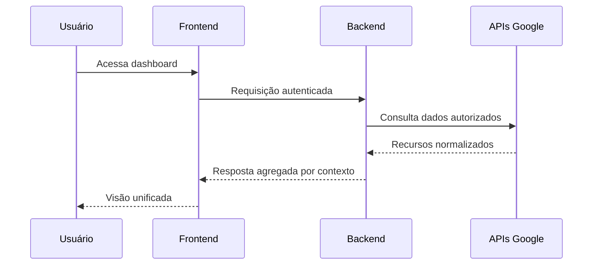
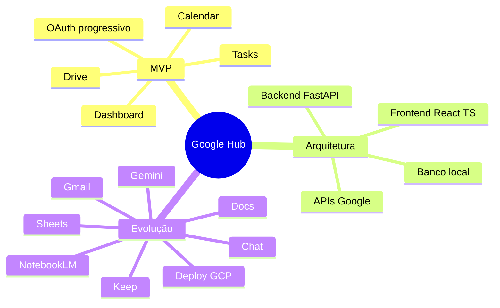

# Google Hub

Projeto pessoal de portfólio para centralizar, em uma única interface, dados e ações de serviços Google usados no dia a dia.

## Posicionamento

O **Google Hub** investiga como criar uma camada própria de organização sobre o ecossistema Google, sem substituir os produtos oficiais.

- foco em produtividade pessoal com **uma conta Google**;
- experiência unificada para reduzir troca de abas e perda de contexto;
- arquitetura preparada para evolução incremental.

## Motivação

Ferramentas como Drive, Calendar, Tasks, Gmail, Docs e Sheets são poderosas, mas operam em contextos separados. O Google Hub busca conectar esses contextos por projeto, tarefa e rotina.

## Relação com o 9Drive

O repositório [zenhosta/9drive](https://github.com/zenhosta/9drive) é uma **referência de estudo arquitetural** para padrões de integração, OAuth e organização modular.

- não é dependência direta deste projeto;
- não será copiado integralmente;
- inspira decisões de desenho técnico para um hub pessoal.

## MVP atual e escopo futuro

### MVP (em construção)

- autenticação Google (escopos progressivos);
- integração inicial com Drive, Calendar e Tasks;
- dashboard unificado com visão de contexto;
- organização de recursos por projeto.

### Escopo futuro (planejado)

- Gmail, Docs, Sheets, Gemini, Keep, Chat e NotebookLM;
- automações entre serviços (ex.: e-mail para tarefa);
- camadas de observabilidade, segurança e deploy em nuvem.

## Stack planejada


- **Backend**: Python, FastAPI, Uvicorn
- **Frontend**: React, TypeScript
- **Dados**: SQLite (local), evolução para banco gerenciado em produção
- **Integrações**: APIs Google com OAuth 2.0

## Arquitetura (alto nível)

```mermaid
flowchart LR
    UI[Frontend React + TypeScript] --> API[Backend FastAPI]
    API --> DB[(SQLite local)]
    API --> OAuth[Google OAuth 2.0]
    OAuth --> Services[APIs Google\nDrive | Calendar | Tasks | ...]
```

## Fluxo de dados (MVP)



## Mapa mental



Referências de navegação:
- [Plano de desenvolvimento](./docs/PLANO_DE_DESENVOLVIMENTO.md)
- [Arquitetura detalhada](./docs/architecture/README.md)
- [Roadmap](./docs/roadmap/README.md)

## Status de integrações Google

| Serviço | Status no projeto | Estratégia inicial | Documentação oficial |
|---|---|---|---|
| Google Drive | Planejado para MVP | API oficial + links para abrir no Google | https://developers.google.com/workspace/drive/api/guides/about-sdk |
| Google Calendar | Planejado para MVP | API oficial para eventos e agenda | https://developers.google.com/workspace/calendar/api/guides/overview |
| Google Tasks | Planejado para MVP | API oficial para listas e tarefas | https://developers.google.com/workspace/tasks/overview |
| Gmail | Futuro | Leitura contextual e vínculos por projeto | https://developers.google.com/workspace/gmail/api/guides |
| Google Docs | Futuro | Criação/edição orientada por fluxo | https://developers.google.com/workspace/docs/api/how-tos/overview |
| Google Sheets | Futuro | Dados tabulares e apoio a projetos | https://developers.google.com/workspace/sheets/api/guides/concepts |
| Gemini | Futuro | Resumos e assistente de produtividade | https://ai.google.dev/gemini-api/docs |
| Google Keep | Futuro | Notas e organização pessoal | https://developers.google.com/workspace/keep |
| Google Chat | Futuro | Conversas e ações contextuais | https://developers.google.com/workspace/chat |
| NotebookLM | Futuro | Atalhos e integração indireta | https://notebooklm.google/ |

## Estrutura do repositório

```text
google-hub/
├── backend/
│   ├── app/
│   │   ├── api/
│   │   ├── auth/
│   │   ├── config/
│   │   ├── db/
│   │   ├── integrations/
│   │   ├── projects/
│   │   ├── resources/
│   │   ├── services/
│   │   ├── shared/
│   │   └── main.py
│   ├── tests/
│   │   ├── unit/
│   │   └── integration/
│   ├── .env.example
│   ├── README.md
│   └── requirements.txt
├── frontend/
│   ├── src/
│   │   ├── assets/
│   │   ├── components/
│   │   ├── layouts/
│   │   ├── lib/
│   │   ├── pages/
│   │   ├── services/
│   │   ├── styles/
│   │   └── types/
│   └── README.md
├── docs/
│   ├── architecture/
│   ├── decisions/
│   ├── guides/
│   ├── roadmap/
│   ├── LINKEDIN.md
│   └── PLANO_DE_DESENVOLVIMENTO.md
├── infra/
│   ├── docker/
│   └── gcp/
├── scripts/
└── tests/
    └── fixtures/
```

## Roadmap de setup

1. Estrutura base do repositório e documentação.
2. Backend FastAPI mínimo (`GET /health`).
3. Configuração de ambiente local e padrões de projeto.
4. Primeira integração OAuth e coleta de dados de serviços MVP.
5. Dashboard inicial e vínculos entre recursos.

## Segurança

- Não versionar segredos ou `.env` reais.
- Usar escopos OAuth mínimos e progressivos.
- Tratar tokens como dados sensíveis.
- Em produção, migrar segredos para serviço dedicado (ex.: Secret Manager).

## Status

- [x] Definição do posicionamento e escopo do projeto
- [x] Estrutura inicial de diretórios e documentos base
- [x] Starter backend com endpoint `GET /health`
- [ ] Implementação da autenticação Google
- [ ] Integrações MVP (Drive, Calendar, Tasks)
- [ ] Dashboard inicial

## Documentação complementar

- [Texto para LinkedIn](./docs/LINKEDIN.md)
- [Plano de desenvolvimento](./docs/PLANO_DE_DESENVOLVIMENTO.md)
- [Arquitetura](./docs/architecture/README.md)
- [Decisão 0001](./docs/decisions/0001-project-foundation.md)

## Contribuição e nota de portfólio

Este repositório é público para estudo e portfólio. Sugestões de arquitetura, segurança e produto são bem-vindas via issue.
Itens marcados como “futuro” são planejados e ainda não implementados.
